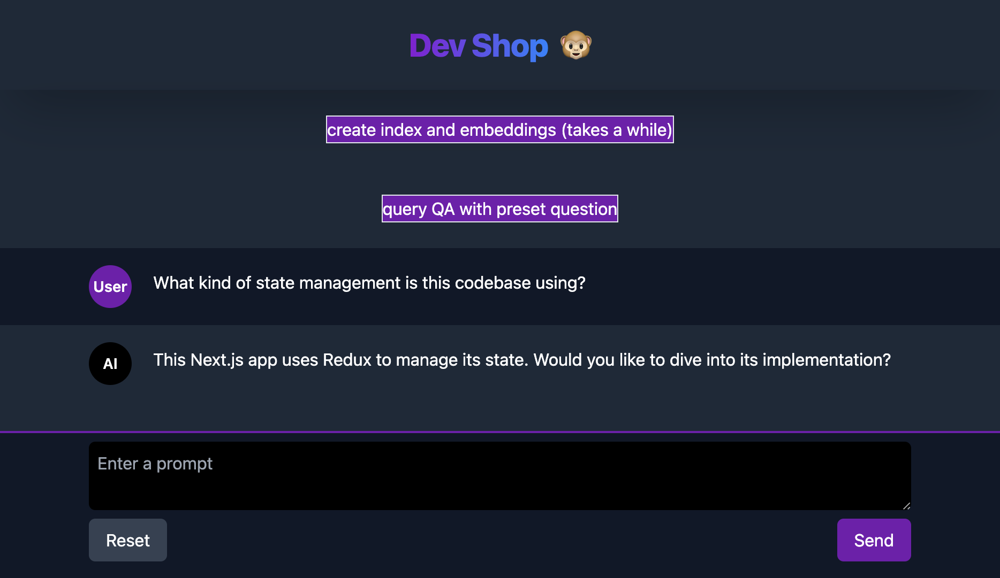

# Code Chat

Experimental dev setup for a chat bot connected to local repo and docs to assist with coding.




## Stack
- Next
- tRPC
- Pinecone vector db
- Langchain

## Setup

First, create a `.env` based on `.env.example`.

## Install
```
npm install
```

## Development
```
npm run dev
```
